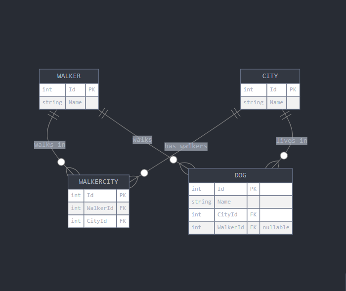

# DeShawn's Dog Walking
OVERVIEW:
In this project I build a full stack application with a React client and .NET API. This project uses a different method for handling CORS. (In vite.config.js)

In DeShawn's Dog Walking, a city can have many walkers in it, and a walker can walk in many cities. Therefore, the relationship between walker and city is many-to-many.

This project demonstrates proficiency in:
Full-stack development
React ecosystem
.NET Web API development
RESTful API design
Database relationship modeling
User experience design
Problem-solving and debugging

# ERD AND WIREFRAME:

Navigation Flow Summary
________________________________________________________________

Key Navigation Paths:
Home (Dogs List) → Click dog name → Dog Details
Dogs List → Click "Add Dog" → Add Dog Form
Nav: Walkers → Walkers List → Click "Add Dog" → Available Dogs for Walker
Walkers List → Click walker name → Edit Walker Form
Nav: Cities → Cities Management

Common UI Elements:
Navigation Bar: Always visible with Dogs, Walkers, Cities links
Buttons: Green for primary actions, Red for delete/remove
Forms: Clear labels, appropriate input types
Lists: Consistent card-style layout for items

CONTRIBUTORS:
Christopher Pack https://github.com/totallypack
